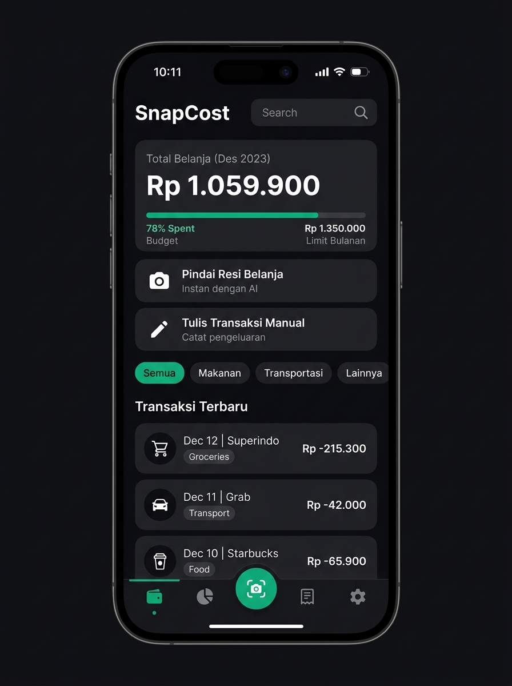

# SnapCost

> Solusi Hemat Pengeluaran

Aplikasi pencatat dan pengelola pengeluaran cerdas berbasis React Native dan Expo. SnapCost dirancang dengan antarmuka Swiss Minimalist FinTech yang berfokus pada kecepatan, privasi data lokal (offline-first), serta kemudahan mencatat transaksi baik melalui pemindaian resi fisik (OCR) maupun input manual.

---

## Antarmuka Aplikasi

<p align="center">
  
</p>

---

## Fitur Utama

- **Pindai Resi Belanja (OCR)**: Ekstraksi otomatis nama toko, tanggal, dan nominal total belanja langsung dari kamera atau galeri foto.
- **Pencatatan Transaksi Manual**: Input transaksi pengeluaran langsung dari beranda tanpa memerlukan foto struk fisik.
- **Pelacakan Batas Anggaran Bulanan**: Pantau persentase penggunaan anggaran bulanan dengan bilah progres adaptif dan indikator peringatan visual.
- **Analisis dan Visualisasi Pengeluaran**:
  - Grafik batang perbandingan pengeluaran antar bulan.
  - Diagram lingkaran distribusi pengeluaran per kategori.
- **Filter Kategori Dinamis**: Kategorisasi transaksi lengkap (Makanan, Transportasi, Belanja, Tagihan, Hiburan, Kesehatan, Pendidikan, Lainnya) dengan warna dan ikon tematik.
- **Proteksi Biometrik**: Kunci akses aplikasi menggunakan sensor sidik jari atau Face ID untuk menjaga privasi finansial.
- **Pengingat Harian**: Notifikasi harian dengan kustomisasi jam dan menit sesuai jadwal pengguna.
- **Penyimpanan Lokal dan Aman (Offline-First)**: Data tersimpan secara privat di perangkat menggunakan SQLite tanpa ketergantungan server eksternal.
- **Ekspor Data ke CSV**: Fasilitas unduh dan bagikan rekapitulasi data transaksi dalam format spreadsheet CSV.
- **Desain Minimalis Swiss**: Palet warna matte bertema gelap dengan aksen emerald, ramah di mata, dan adaptif terhadap navigasi gestur Android dan iOS.

---

## Tumpukan Teknologi

- **Framework**: React Native 0.81, Expo SDK 54
- **Routing**: Expo Router (File-based navigation)
- **Bahasa**: TypeScript 5.3 (Strict Mode)
- **Basis Data**: Expo SQLite
- **Kamera dan Gambar**: Expo Camera, Expo Image Picker, Expo Image Manipulator
- **Keamanan**: Expo Local Authentication
- **Notifikasi**: Expo Notifications
- **Ikonografi**: @expo/vector-icons (Ionicons)
- **Manajemen State**: React Context API dengan custom hooks

---

## Struktur Direktori

```text
snapcostexpo/
├── app/                      # Rute halaman (Expo Router)
│   ├── (tabs)/               # Navigasi tab utama
│   │   ├── index.tsx         # Dasbor ringkasan pengeluaran
│   │   ├── analytics.tsx     # Analitik dan grafik
│   │   ├── scan.tsx          # Pemindai kamera resi
│   │   ├── history.tsx       # Riwayat dan pencarian transaksi
│   │   └── settings.tsx      # Pengaturan akun, anggaran, dan sistem
│   ├── scan-review.tsx       # Review hasil scan dan form input
│   └── transaction/[id].tsx  # Detail dan edit transaksi
├── assets/                   # Ikon, logo, dan mockup aplikasi
├── components/               # Komponen UI modular
│   ├── analytics/            # Komponen grafik analitik
│   ├── dashboard/            # Komponen kartu dan widget beranda
│   └── ui/                   # Elemen dasar (Button, Card, Header, dll.)
├── constants/                # Tema, kategori, utilitas tanggal, dan data awal
├── database/                 # Konfigurasi SQLite dan repository data
├── hooks/                    # Custom hooks (tema, transaksi, haptik)
├── services/                 # Layanan OCR, biometrik, notifikasi, dan ekspor
└── types/                    # Definisi tipe TypeScript
```

---

## Memulai Pengembangan

### Prasyarat

- Node.js versi 18 atau lebih baru
- npm atau yarn
- Aplikasi Expo Go di perangkat fisik (Android atau iOS) atau emulator

### Instalasi

1. Klon repositori ini:

   ```bash
   git clone https://github.com/Novazeb/snapcostexpo.git
   cd snapcostexpo
   ```

2. Pasang dependensi:

   ```bash
   npm install
   ```

3. Jalankan server pengembangan Expo:

   ```bash
   npx expo start
   ```

4. Pindai kode QR yang muncul di terminal menggunakan aplikasi Expo Go pada perangkat Android, atau kamera pada perangkat iOS.

---

## Lisensi

Proyek ini didistribusikan di bawah lisensi MIT.
